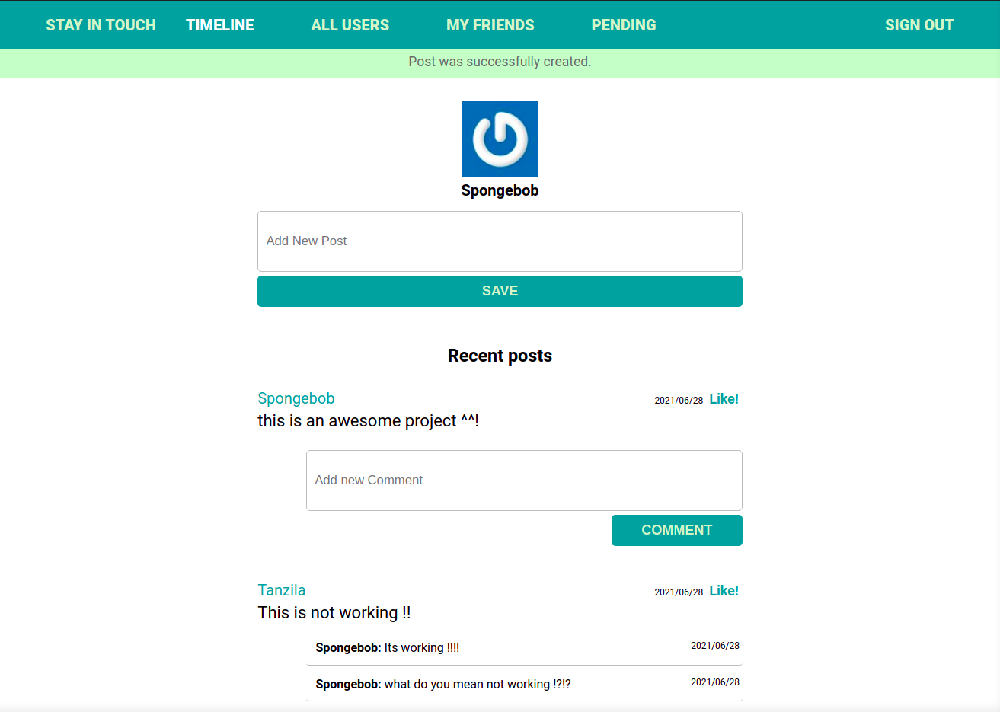
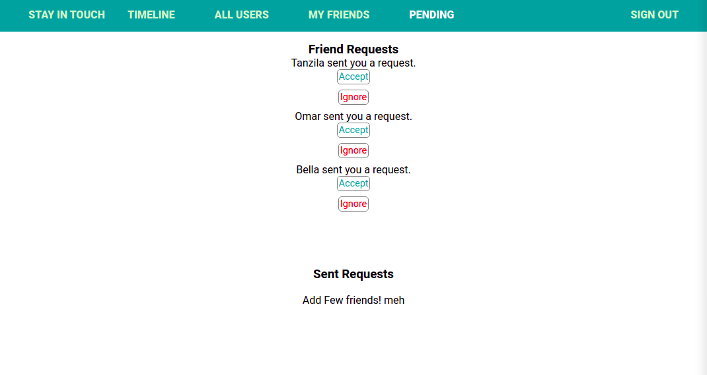
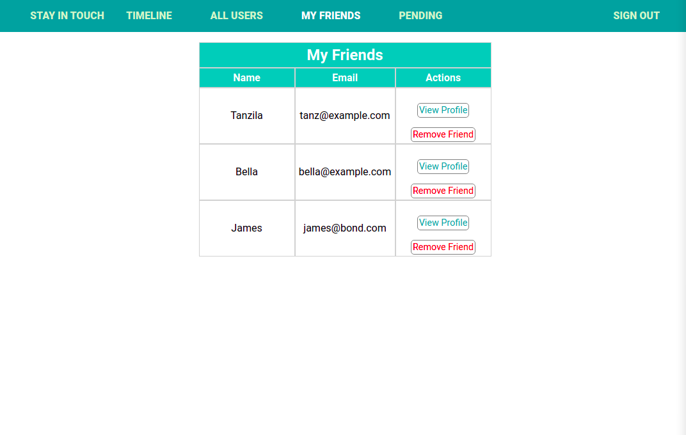
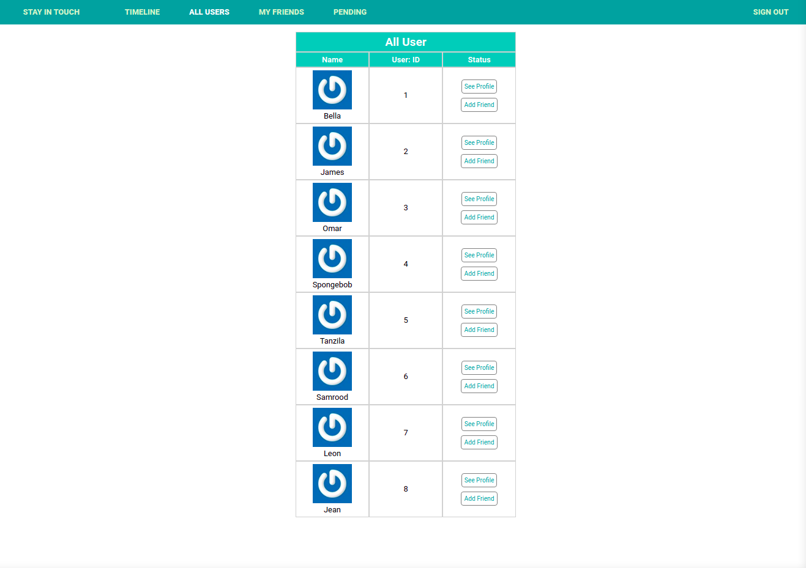

# Scaffold for social media app with Ruby on Rails

> This repo includes intial code for social media app with basic styling. Its purpose is to be a starting point for Microverse students.

>  To visit, click here : https://intense-hamlet-58342.herokuapp.com/

| Timeline | Pending | Friends | All Users
| --- | --- | --- | --- |
|  |  |  | 

## Database Model


## Built With

- Ruby v2.7.0
- Ruby on Rails v5.2.4


## Getting Started


To get started with the app, first clone the repo and `cd` into the directory:

```
$ git clone https://github.com/od-c0d3r/ror-social-scaffold.git
$ cd ror-social-scaffold
```

### Prerequisites

Ruby: 2.6.3
Rails: 5.2.3
Postgres: >=9.5

### Setup

Install gems with:

```
bundle install
```

Setup database with:

```
   rails db:create
   rails db:migrate
```

### Github Actions

To make sure the linters' checks using Github Actions work properly, you should follow the next steps:

1. On your recently forked repo, enable the GitHub Actions in the Actions tab.
2. Create the `feature/branch` and push.
3. Start working on your milestone as usual.
4. Open a PR from the `feature/branch` when your work is done.


### Usage

Start server with:

```
    rails server
```

Open `http://localhost:3000/` in your browser.

### Run tests

```
    rpsec --format documentation
```

### Deployment
To deploy the sample app to production, you’ll need a Heroku account

To deploy this version of the app, you’ll need to create a new Heroku application, switch to the right branch, push up the source, run the migrations, and seed the database with sample users:

```
$ heroku create
$ git checkout updating-users
$ git push heroku updating-users:master
$ heroku run rails db:migrate
$ heroku run rails db:seed
```

Visiting the URL returned by the original `heroku create` should now show you the sample app running in production. 

## Authors

👤 **Tanzila**


- GitHub: [@githubhandle](https://github.com/tanzila-abedin)
- Twitter: [@twitterhandle](https://twitter.com/TanzilaAbedin)
- LinkedIn: [Profile](https://www.linkedin.com/in/tanzila-abedin-331440b2/)

👤 **Omar R.**


- GitHub: [@od-c0d3r](https://github.com/od-c0d3r)
- Twitter: [@od-coder](https://twitter.com/od_coder)
- LinkedIn: [Profile](https://linkedin.com/in/omarrashad)

## 🤝 Contributing

Contributions, issues and feature requests are welcome!

## Show your support

Give a ⭐️ if you like this project!

